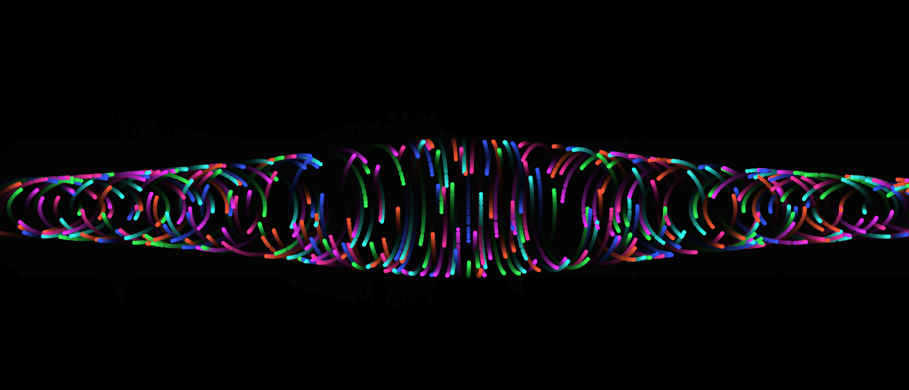

# DNA-Like: Canvas Motion Animation

This project is a dynamic canvas animation where colorful dots move in a DNA-like structure and interact with the mouse pointer, creating an engaging visual effect.

## Features

- **Responsive Canvas**: The canvas resizes to fit the window.
- **Mouse Interaction**: Dots are attracted to the mouse pointer and change size and color when near the mouse.
- **Smooth Animation**: The dots move in a smooth, sinusoidal motion.
- **Media Assets**: Includes a video for demonstration purposes.

## Getting Started

### Prerequisites

To run this project, you need a modern web browser with JavaScript enabled.

### Installation

1. Clone the repository or download the files.
2. Ensure the `assets` folder contains `video.mp4`.
3. Open the `index.html` file in your browser.

### Usage

- Move the mouse around the canvas to see the dots interact with the pointer.
- Resize the window to see the canvas adjust accordingly.

### Media Assets

- `assets/video.mp4`: A video demonstrating the animation.
